# 2020q3 Homework1 (quiz1)
contributed by < `MingRuey` >

### **測驗1**

程式運作原理
---

### **add_entry**
---
先創造一個值為 new_value 的節點之後，用 assert 檢查新節點是否創成功。
> :warning: TODO: 研究為什麼 assert 在 ```new_node->value``` , ```new_node->next``` 賦值後面，而不是前面，這樣的寫法在 mallloc 失敗的時候行為是什麼?

接著理解如何用 pointer to pointer 在 linked list 的尾巴擺上剛剛創造的節點:

首先我們有個串列
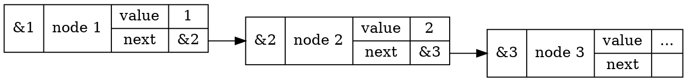

接著研究 while 迴圈的判斷式 ```*indirect```，*indirect 的型態是 pointer *node_t ，在一開始 *indirect 會取出 head 的地址:

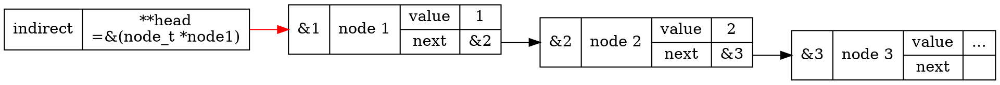

接著來看 ```indirect = &(*indirect)->next``` 一行， ```(*indirect)->next``` 的型態是 pointer *node ，指向 pseudo pointer 的 next ， & operator 使得 **indirect 的值為 next 地址** :

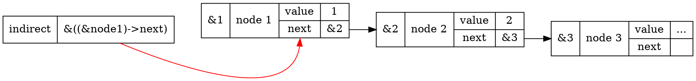

這個過程會反覆到 *indirect 為 null pointer 為止，也就是如下圖的狀況:

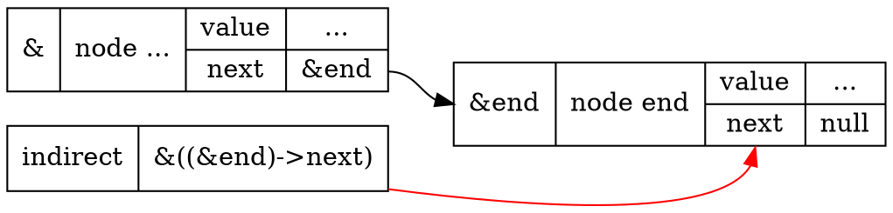

離開迴圈之後， ```*indirect = new_node``` 讓 indirect 的內容，也就是 end 的 next 更新為新創造的 new_node，完成新增節點在結尾:

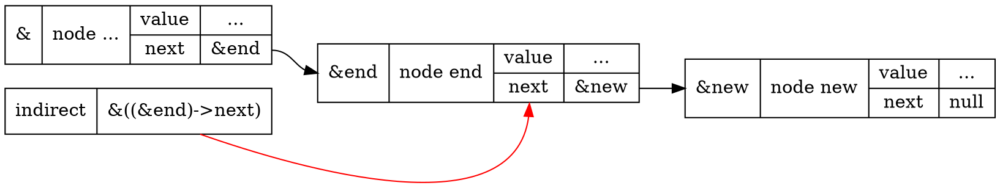

### **find_entry**
---
find_entry 的運作相對來說比較簡單，一開始 current 指向 head 的地址:
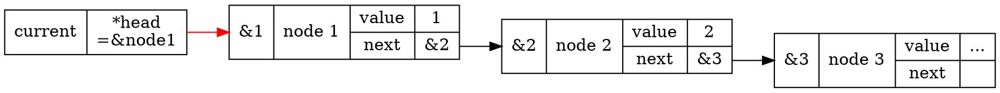

接著研究 for loop 終止的條件 ```current && current->value != value``` 也就是 current 是 null pointer 或是 current 就是要尋找的值，搭配每圈 ```current = current->next``` 的更新，在 ```current->value == value``` 的情況下，會回傳當前的節點:

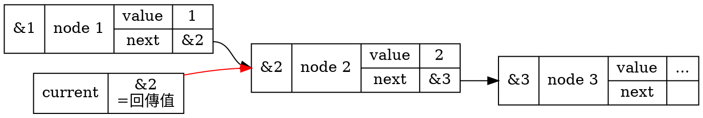
另外一種情況則是 current 為 null pointer 跳出迴圈，也就是已經遍歷了整個串列的情況，此時就會回傳 null pointer:
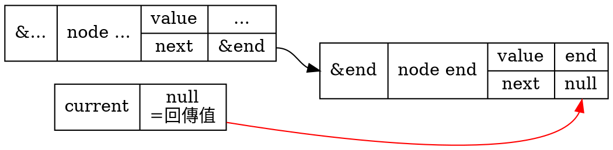

### **remove_entry**
---
remove_entry 的寫法思路跟跟之前的 add_entry 相似，只差在 while loop 終止的判斷式以及離開迴圈之後的行動，我們先看終止條件 ```(*indirect) != entry``` :


```*indirect``` 會取到 ```**indirect``` 指向的 next 的值 (第一次進行時則是 &head )，所以判斷式會與目標地址 ```*entry``` 比較，如果一樣才會離開迴圈。

接著離開迴圈之後的行為，```*indirect = entry->next``` 會把 indirect 指向的記憶體位置的內容以 ```entry->next``` 複寫:

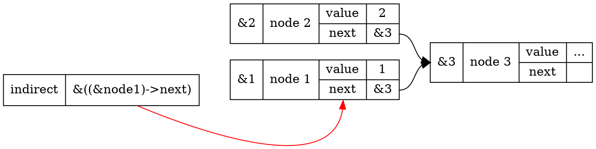

另外我們注意包刮 entry 是 null pointer，或是 entry 沒找到的情況下，傳入 ```free(entry)``` 的內容會是 null pointer ，此時根據 C99 ，free 函式會什麼都不做，所以 remove_entry 在這兩個情況下都是安全的:

> C99 7.20.3.2.2 
>
> The free function causes the space pointed to by ptr to be deallocated, that is, made available for further allocation. If ptr is a null pointer, no action occurs. Otherwise, if
the argument does not match a pointer earlier returned by the calloc, malloc, or realloc function, or if the space has been deallocated by a call to free or realloc, the behavior is undefined.

### **swap_pair**
---
for loop 的初始條件 ```node_t **node = &head``` 讓我們產生與 add_entry 相同的初始狀態:

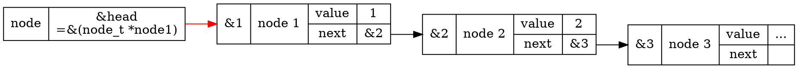

接著判斷條件 ```*node && (*node)->next``` 判斷當前的 node 與串列中下一個 node 都非 null pointer ，也就是節點存在，才會進行 for loop 內 swap 的動作，之後用 ```node = &(*node)->next->next``` 將 node 往前移動兩個節點:

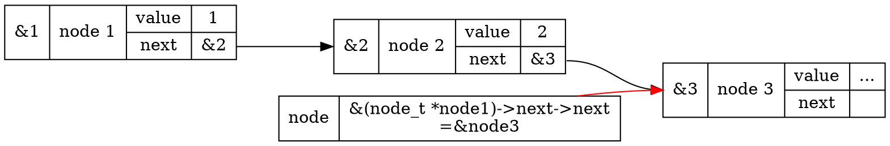

接著我們圖示化 swap 的過程:

```note_t *tmp = *node``` :
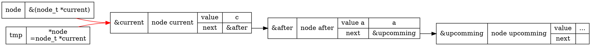

```*node = (*node)->next``` :
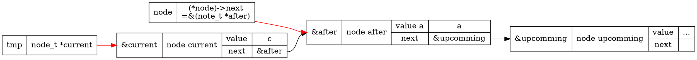

```tmp->next = (*node)->next``` :
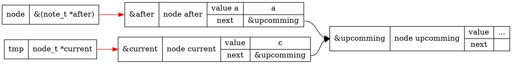

```(*node)->next = tmp``` ，至此 after 跟 current 已經交換過來，也注意到這時候 node 如果照上述討論往前走兩個 node ，就指向了下一個要交換的節點 upcomming :
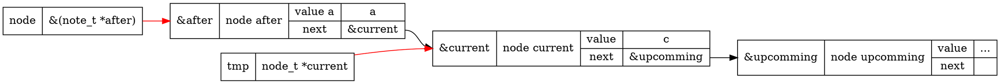

### **reverse**
---

首先我們來看起串列的起頭是如何正確被反轉的，一開始 ```node_t *cursor``` 設為 NULL 以及 ```node_t *next = head->next``` :

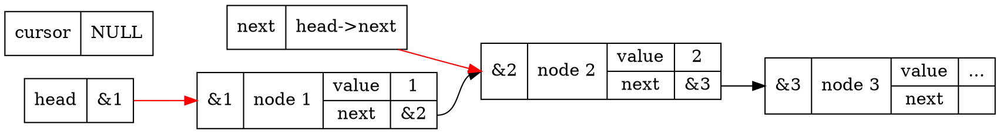

接著反接的過程 (1) ```head->next = cursor``` :
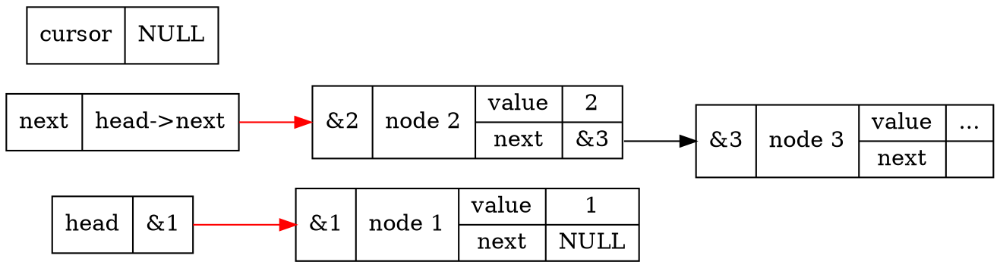

反接的過程 (2) ```cursor = head``` :
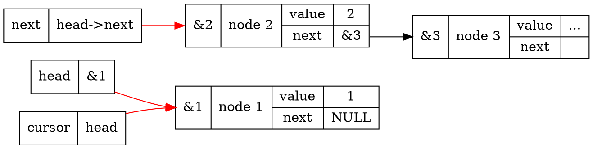

反接的過程 (3) ```head = next``` :
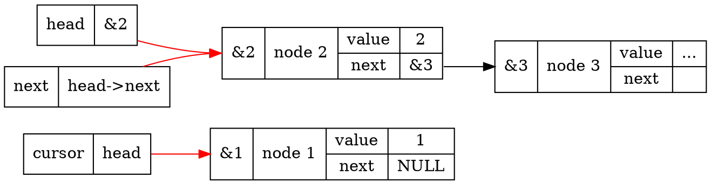

我們可以看到 while loop 執行一次， head 指向的節點的 next 會指向 cursor 的值 (在第一次執行時是 NULL)，而且 head 跟 next 在結束的時候會指向 cursor 的下一個節點，所以再跑一次迴圈就會得到:

```graphviz
digraph init{
    rankdir=LR;
    node [shape=record];
    1 [label="{<address>&1|node 1|{value|next}|{1|<ref>NULL}}"];
    2 [label="{<address>&2|node 2|{value|next}|{2|<ref>&1}}"];
    3 [label="{<address>&3|node 3|{value|next}|{...|<ref>}}"];
    2:ref -> 1:address [color=black];
    
    head [label="{head|&2}"];
    head -> 3:address [color=red]
    cursor [label="{cursor|head}"]cursor
    cursor -> 2:address [color=red]
    next [label="{next|head\-\>next\n}"]
    next -> 3:address [color=red]
}
```

也就是每跑一次，可以完成 ```cursor``` 與 ```cursor->next``` 的反接 (第一次執行完成 head 與 NULL 的反接!)，並且把 head 與 next 指向下一個反接的節點，直到 head 為 null pointer 為止。


TODO: 
---
:::success
延伸問題:

函式 swap_pair 和 reverse 對於指標的操作方式顯然異於 add_entry 及 remove_entry，需要額外做 head = ... 的更新，請用指標的指標來改寫，並避免回傳指標;

以遞迴改寫上述的 reverse，注意，你可能因此需要建立新的函式，如 rev_recursive，隨後在 reverse 函式中呼叫 rev_recursive;

針對 singly-linked list 的節點，實作 Fisher–Yates shuffle，你應該儘量降低記憶體的使用量;
:::