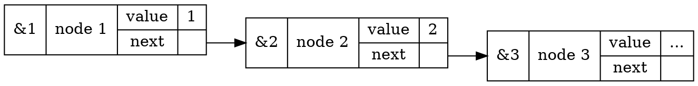
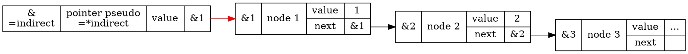
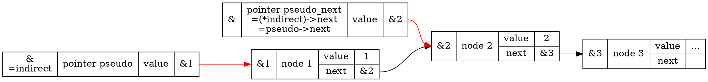
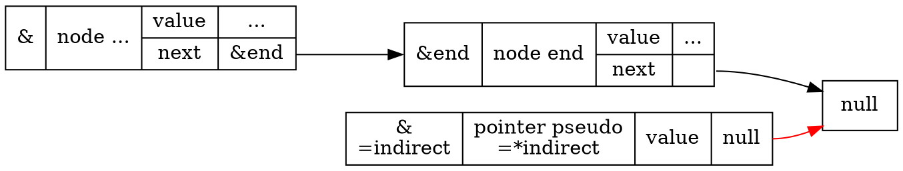
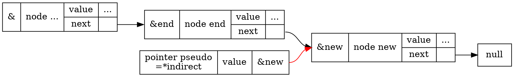

# 2020q3 Homework1 (quiz1)
contributed by < `MingRuey` >

### **測驗1**

程式運作原理
---

**add_entry**

先創造一個值為 new_value 的節點之後，用 assert 檢查新節點是否創成功。
> :warning: TODO: 研究為什麼 assert 在 ```new_node->value``` , ```new_node->next``` 賦值後面，而不是前面，這樣的寫法在 mallloc 失敗的時候行為是什麼?

接著理解如何用 pointer to pointer 在 linked list 的尾巴擺上剛剛創造的節點:

首先我們有個串列


接著研究 while 迴圈的判斷式 ```*indirect```， *indirect 的型態是 pointer *node_t ，我們以一個假想的 pseudo pointer 圖示化 *indirect 的值:



接著來看 ```indirect = &(*indirect)->next``` 一行， ```(*indirect)->next``` 的型態是 pointer *node ，指向 pseudo pointer 的 next ，所以這行會將 indirect 的內容指向 pseudo pointer 的 next 的 address 圖中的 pseudo_next :



這個過程會反覆到 *indirect 為 null pointer 為止，也就是如下圖的狀況:



離開迴圈之後， ```*indirect = new_node``` 讓 indirect 的內容，也就是 end 的 next 更新為新創造的 new_node，完成新增節點在結尾:




**remove_entry**
...

**swap_pair**
...

**reverse**
...

:::success
延伸問題:

函式 swap_pair 和 reverse 對於指標的操作方式顯然異於 add_entry 及 remove_entry，需要額外做 head = ... 的更新，請用指標的指標來改寫，並避免回傳指標;

以遞迴改寫上述的 reverse，注意，你可能因此需要建立新的函式，如 rev_recursive，隨後在 reverse 函式中呼叫 rev_recursive;

針對 singly-linked list 的節點，實作 Fisher–Yates shuffle，你應該儘量降低記憶體的使用量;
:::