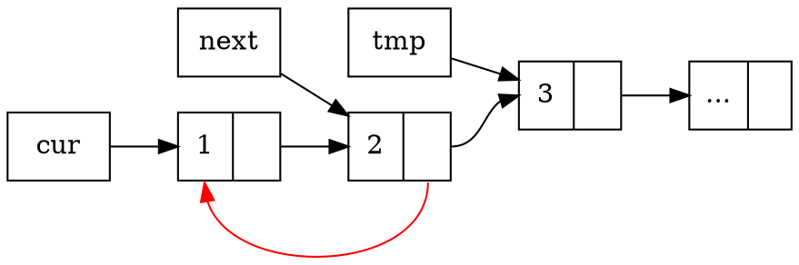
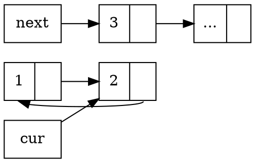

# 2020q3 Homework1 (lab0)
contributed by < `MingRuey` >

:::spoiler
:warning: 請詳閱作業說明，務必從 GitHub fork 原有的 `lab0-c` repository，而非自行建立新的 repository，工程人員應當留意各式細節。
:notes: jserv
> 已 Fork [lab0-c](https://github.com/sysprog21/lab0-c) 並修正 GitHub 連結至 [該 Repo](https://github.com/MingRuey/lab0-c)

詳閱作業要求，中英文字元之間用一個半形空白區隔。另外，`GitHub` 的 "G" 和 "H" 字元應大寫，符合該公司品牌書寫方式
:notes: jserv
> 感謝，已修正

:warning: [作業區](https://hackmd.io/@sysprog/2020-homework1) 登記時用 GitHub 帳號
> 已經用 GitHub 帳號重新 pull 檔案，並更新連結
:::

實作流程
---

**q_insert_head**, **q_insert_tail**

創造新的 ```lst_ele_t``` 幾個注意的地方:

* val 的記憶體大小要考慮 trailing null byte ，```size_t s_length = strlen(s) + 1;``` strlen 的文件指出:
    > The strlen() function calculates the length of the string pointed to by s, excluding the terminating null byte ('\0').

* memcpy 取代 strcpy ，因為
    > 依據 [CERN Common vulnerabilities guide for C programmers](https://security.web.cern.ch/recommendations/en/codetools/c.shtml) 建議而移除 gets / sprintf / strcpy 等不安全的函式;

除了上述關於創造新節點的細節之外，此 ```q_insert_tail``` 函式要求的時間複雜度是 O(1) ，我選擇在 queue_t 的定義裡面加上一個紀錄尾巴所在位置的指標。

接著在 ```q_insert_head``` 在更新頭的指標之後，也要考慮 empty queue 的情況，尾巴的只要也要一併更新，反過來 ```q_insert_tail``` 的時候也要考慮 empty 的情況去對應更新頭。

**q_remove_head**

先取出頭的指標，令其為 target，接著更新 queue ，記得要處理 queue 只有一個 element 的情況。接著若 sp 不為 NULL ，要複製 ```target->value``` 到 sp 上，此時一樣要注意 strlen 的行為不包含 trailing null byte 。

**q_reverse**
我採用三指標的方式將 linked list 反向，首先排除小於兩個元素的 queue，接著用兩個指標指向 ```q->head``` 跟 ```q->head->next```，並且再用一個指標指向 ```q->head->next->next```，因為反向連節點的過程中要保留下一個節點的位置:

如上述圖表所示，用 tmp 先記好未來 next 要去的地方，接著把 next 所在的節點連回 cur ，最後兩個指標都往下走一步:

而起頭所在的節點，也就是上圖的 1 ，則在迴圈結束之後設為 NULL 就處理完畢了。

在第一次寫出 q_reverse 的時候立刻進行了測試，發現我得到了 **許多的 Segmentation fault** ，首先我在 qtest 中鍵入:
```
new
free
new
ih first
```
到 ```ih first``` 出現 ```Segmentation fault occurred.  You dereferenced a NULL or invalid pointer```，發現我忘了把新創好的 ```char *``` assign 給 ```list_ele_t->value``` ...

處理完這個 bug ，測試的分數已經來到 59/100，扣掉還沒實作的 q_sort ， trace-07, trace-11, trace-12 都還有 momery problem，正要 commit 的時候 Cppcheck 又幫我抓了一個 memory leak，我在建立節點的時候:

```c
static list_ele_t *loc_element(char *s)
{
    list_ele_t *new = malloc(sizeof(list_ele_t));
    if (!new) {
        return NULL;
    }

    size_t s_length = strlen(s) + 1;
    char *val = malloc(sizeof(char) * s_length);
    if (!val) {
        return NULL;
    }
    ...
}
```
#11 ```return NULL``` 忘了處理前面已經 malloc 好的 new ，解完這個 bug ，分數來到了 71/100 ，主要剩下 trace-07 的 memory problem ，以及 q_sort 至此先 commit。

---

我鍵入 make valgrind 給了我比較細的錯誤訊息，我閱讀了 Valgrind 的教學，了解我的 Segmentation fault 發生在對 NULL queue 取 size:

```
...
+++ TESTING trace trace-07-robust:
# Test operations on NULL queue
==85154== Invalid read of size 4
==85154==    at 0x10CD7A: q_size (queue.c:161)
==85154==    by 0x109AC9: do_size (qtest.c:512)
==85154==    by 0x10B992: interpret_cmda (console.c:220)
==85152==    by 0x10BF06: interpret_cmd (console.c:243)
==85154==    by 0x10C4D4: cmd_select (console.c:569)
==85154==    by 0x10C71C: run_console (console.c:628)
==85154==    by 0x10AE41: main (qtest.c:772)
==85154==  Address 0x10 is not stack'd, malloc'd or (recently) free'd
==85154==
Segmentation fault occurred.  You dereferenced a NULL or invalid pointer
...
```

這個 bug 也可以在 qtest 中對 NULL queue 執行 ```size``` 重現。
做一個小修改之後就搞定了。

---

接著開始撰寫 q_sort ，這裡採用的演算法是 MergeSort，策略主要是用一個　pointer to pointer (head) 直接更新 recursive function 的輸入，並且利用 ```q->size``` 我們可以簡單地找到 queue 的中點來進行分割。

```cpp
static void recur_sort(list_ele_t **target, int length)
{
    if (length <= 1) {
        return;
    }
    list_ele_t **left_head = target, **right_head = target;
    int middle = length / 2;
    for (int i = middle; i > 1; i--) {
        right_head = &(*right_head)->next;
    }
    // just right before the middle element
    list_ele_t *next = (*right_head)->next;
    (*right_head)->next = NULL;
    right_head = &next;

    recur_sort(left_head, middle);
    recur_sort(right_head, length - middle);

    list_ele_t *last = *target, *left = *left_head, *right = *right_head;
    bool flag = false;
    while (true) {
        if (!left) {
            last->next = right;
            break;
        } else if (!right) {
            last->next = left;
            break;
        }

        if (strcmp(left->value, right->value) <= 0) {
            if (!flag) {
                flag = true;
                *target = left;
                last = left;
            } else {
                last->next = left;
                last = left;
            }
            left = left->next;
        } else {
            if (!flag) {
                flag = true;
                *target = right;
                last = right;
            } else {
                last->next = right;
                last = right;
            }
            right = right->next;
        }
    }
}
```

以上是我完成的第一版，結果測試得到 94/100 ，再次使用 Valgrind 進行記憶體除錯，訊息如下 (queue.c #262 是 ```right_head = &(*right_head)->next;```)，讓我得知我在取中點的時候有 derefernce NULL pointer。

```
...
==103272== Invalid read of size 8
==103272==    at 0x10CC2E: recur_sort (queue.c:206)
==103272==    by 0x10CF0F: q_sort (queue.c:262)
==103272==    by 0x109D37: do_sort (qtest.c:552)
==103272==    by 0x10B992: interpret_cmda (console.c:220)
==103272==    by 0x10BF06: interpret_cmd (console.c:243)
==103272==    by 0x10C4D4: cmd_select (console.c:569)
==103272==    by 0x10C71C: run_console (console.c:628)
==103272==    by 0x10AE41: main (qtest.c:772)
==103272==  Address 0x8 is not stack'd, malloc'd or (recently) free'd
==103272==
Segmentation fault occurred.  You dereferenced a NULL or invalid pointer
...
```

## TODO:
- Debug Sort
- Valgrind 排除 qtest 實作的記憶體錯誤
- Massif 視覺化
- 研讀 Dudect
