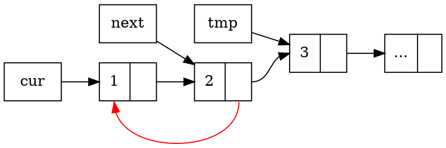
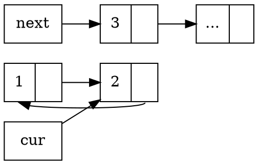

# 2020q3 Homework1 (lab0)
contributed by < `MingRuey` >

:::spoiler
:warning: 請詳閱作業說明，務必從 GitHub fork 原有的 `lab0-c` repository，而非自行建立新的 repository，工程人員應當留意各式細節。
:notes: jserv
> 已 Fork [lab0-c](https://github.com/sysprog21/lab0-c) 並修正 GitHub 連結至 [該 Repo](https://github.com/MingRuey/lab0-c)

詳閱作業要求，中英文字元之間用一個半形空白區隔。另外，`GitHub` 的 "G" 和 "H" 字元應大寫，符合該公司品牌書寫方式
:notes: jserv
> 感謝，已修正

:warning: [作業區](https://hackmd.io/@sysprog/2020-homework1) 登記時用 GitHub 帳號
> 已經用 GitHub 帳號重新 pull 檔案，並更新連結
:::

## 實作流程
---

### **q_insert_head**, **q_insert_tail**

創造新的 ```lst_ele_t``` 幾個注意的地方:

* val 的記憶體大小要考慮 trailing null byte ，```size_t s_length = strlen(s) + 1;``` strlen 的文件指出:
    > The strlen() function calculates the length of the string pointed to by s, excluding the terminating null byte ('\0').

* memcpy 取代 strcpy ，因為
    > 依據 [CERN Common vulnerabilities guide for C programmers](https://security.web.cern.ch/recommendations/en/codetools/c.shtml) 建議而移除 gets / sprintf / strcpy 等不安全的函式;
    > Update: 我想到 q_remove_head 裡面應該也要考慮輸入參數 char *sp ，的長度，避免 buffer overflow 。

除了上述關於創造新節點的細節之外，此 ```q_insert_tail``` 函式要求的時間複雜度是 O(1) ，我選擇在 queue_t 的定義裡面加上一個紀錄尾巴所在位置的指標。

接著在 ```q_insert_head``` 在更新頭的指標之後，也要考慮 empty queue 的情況，尾巴的只要也要一併更新，反過來 ```q_insert_tail``` 的時候也要考慮 empty 的情況去對應更新頭。

### **q_remove_head**

先取出頭的指標，令其為 target，接著更新 queue ，記得要處理 queue 只有一個 element 的情況。接著若 sp 不為 NULL ，要複製 ```target->value``` 到 sp 上，此時一樣要注意 strlen 的行為不包含 trailing null byte 。

### **q_reverse**
我採用三指標的方式將 linked list 反向，首先排除小於兩個元素的 queue，接著用兩個指標指向 ```q->head``` 跟 ```q->head->next```，並且再用一個指標指向 ```q->head->next->next```，因為反向連節點的過程中要保留下一個節點的位置:

如上述圖表所示，用 tmp 先記好未來 next 要去的地方，接著把 next 所在的節點連回 cur ，最後兩個指標都往下走一步:

而起頭所在的節點，也就是上圖的 1 ，則在迴圈結束之後設為 NULL 就處理完畢了。

在第一次寫出 q_reverse 的時候立刻進行了測試，發現我得到了 **許多的 Segmentation fault** ，首先我在 qtest 中鍵入:
```
new
free
new
ih first
```
到 ```ih first``` 出現 ```Segmentation fault occurred.  You dereferenced a NULL or invalid pointer```，發現我忘了把新創好的 ```char *``` assign 給 ```list_ele_t->value``` ...

處理完這個 bug ，測試的分數已經來到 59/100，扣掉還沒實作的 q_sort ， trace-07, trace-11, trace-12 都還有 momery problem，正要 commit 的時候 Cppcheck 又幫我抓了一個 memory leak，我在建立節點的時候:

```c
static list_ele_t *loc_element(char *s)
{
    list_ele_t *new = malloc(sizeof(list_ele_t));
    if (!new) {
        return NULL;
    }

    size_t s_length = strlen(s) + 1;
    char *val = malloc(sizeof(char) * s_length);
    if (!val) {
        return NULL;
    }
    ...
}
```
#11 ```return NULL``` 忘了處理前面已經 malloc 好的 new ，解完這個 bug ，分數來到了 71/100 ，主要剩下 trace-07 的 memory problem ，以及 q_sort 至此先 commit。

---

我鍵入 make valgrind 給了我比較細的錯誤訊息，我閱讀了 Valgrind 的教學，了解我的 Segmentation fault 發生在對 NULL queue 取 size:

```
...
+++ TESTING trace trace-07-robust:
# Test operations on NULL queue
==85154== Invalid read of size 4
==85154==    at 0x10CD7A: q_size (queue.c:161)
==85154==    by 0x109AC9: do_size (qtest.c:512)
==85154==    by 0x10B992: interpret_cmda (console.c:220)
==85152==    by 0x10BF06: interpret_cmd (console.c:243)
==85154==    by 0x10C4D4: cmd_select (console.c:569)
==85154==    by 0x10C71C: run_console (console.c:628)
==85154==    by 0x10AE41: main (qtest.c:772)
==85154==  Address 0x10 is not stack'd, malloc'd or (recently) free'd
==85154==
Segmentation fault occurred.  You dereferenced a NULL or invalid pointer
...
```

這個 bug 也可以在 qtest 中對 NULL queue 執行 ```size``` 重現。
做一個小修改之後就搞定了。

---
### **q_sort**

接著開始撰寫 q_sort ，這裡採用的演算法是 MergeSort，策略主要是用一個　pointer to pointer (head) 直接更新 recursive function 的輸入，並且利用 ```q->size``` 我們可以簡單地找到 queue 的中點來進行分割。

<details>
<summary> 第一版 q_sort </summary>

```cpp
static void recur_sort(list_ele_t **target, int length)
{
    if (length <= 1) {
        return;
    }
    list_ele_t **left_head = target, **right_head = target;
    int middle = length / 2;
    for (int i = middle; i > 1; i--) {
        right_head = &(*right_head)->next;
    }
    // just right before the middle element
    list_ele_t *next = (*right_head)->next;
    (*right_head)->next = NULL;
    right_head = &next;

    recur_sort(left_head, middle);
    recur_sort(right_head, length - middle);

    list_ele_t *last = *target, *left = *left_head, *right = *right_head;
    bool flag = false;
    while (true) {
        if (!left) {
            last->next = right;
            break;
        } else if (!right) {
            last->next = left;
            break;
        }

        if (strcmp(left->value, right->value) <= 0) {
            if (!flag) {
                flag = true;
                *target = left;
                last = left;
            } else {
                last->next = left;
                last = left;
            }
            left = left->next;
        } else {
            if (!flag) {
                flag = true;
                *target = right;
                last = right;
            } else {
                last->next = right;
                last = right;
            }
            right = right->next;
        }
    }
}
```
</details>

以上是我完成的第一版，結果測試得到 94/100 ，再次使用 Valgrind 進行記憶體除錯，訊息如下 (queue.c #262 是 ```right_head = &(*right_head)->next;```)，讓我得知我在取中點的時候有 derefernce NULL pointer。

```
...
==103272== Invalid read of size 8
==103272==    at 0x10CC2E: recur_sort (queue.c:206)
==103272==    by 0x10CF0F: q_sort (queue.c:262)
==103272==    by 0x109D37: do_sort (qtest.c:552)
==103272==    by 0x10B992: interpret_cmda (console.c:220)
==103272==    by 0x10BF06: interpret_cmd (console.c:243)
==103272==    by 0x10C4D4: cmd_select (console.c:569)
==103272==    by 0x10C71C: run_console (console.c:628)
==103272==    by 0x10AE41: main (qtest.c:772)
==103272==  Address 0x8 is not stack'd, malloc'd or (recently) free'd
==103272==
Segmentation fault occurred.  You dereferenced a NULL or invalid pointer
...
```

Debug 第一版在 trace 16 的 segmentation fault 的途中，即便 valgrind 已經幫我找出哪行發生 derefernce null pointer ，但邏輯實在有點太亂了腦袋無法處理，因此改了第二版，將 Merge Sort 合併的部分的邏輯寫清楚而且令提取成一個函式:

<details>
<summary> 第二版程式 </summary>

```
/*
 * Merge two list and return the new head.
 */
static list_ele_t *merge(list_ele_t *head1, list_ele_t *head2)
{
    list_ele_t *merged = NULL;
    list_ele_t *cursor = NULL;
    while (head1 && head2) {
        list_ele_t **head =
            strcmp(head1->value, head2->value) <= 0 ? &head1 : &head2;
        if (!cursor) {
            merged = *head;
            cursor = *head;
        } else {
            cursor->next = *head;
            cursor = cursor->next;
        }
        *head = (*head)->next;
    }

    if (head1) {
        cursor->next = head1;
    } else if (head2) {
        cursor->next = head2;
    }
    return merged;
}

/*
 * Sort the linked list with known length.
 */
static void recur_sort(list_ele_t **target, int length)
{
    if (length <= 1) {
        return;
    }

    list_ele_t *lhead = *target, *rhead = *target;
    int halflen = length / 2;
    for (int i = halflen; i > 1; i--) {
        rhead = rhead->next;
    }
    list_ele_t *tmp = rhead;
    rhead = rhead->next;
    tmp->next = NULL;

    recur_sort(&lhead, halflen);
    recur_sort(&rhead, length - halflen);
    *target = merge(lhead, rhead);
}

/*
 * Sort elements of queue in ascending order
 * No effect if q is NULL or empty. In addition, if q has only one
 * element, do nothing.
 */
void q_sort(queue_t *q)
{
    if (!q || !q->size || q->size == 1) {
        return;
    }

    recur_sort(&q->head, q->size);
    list_ele_t *ele = q->head;
    for (int l = q->size; l > 0; l--) {
        ele = ele->next;
    }
    q->tail = ele;
}
```

</details>

接著繼續檢查 trace 16 的 segmentation fault ，在一陣兵荒馬亂之後，我發現我的 q->sort，trace 16 的內容是 sort, reverse 再 sort ，我觀察到我的函示在第一次 sort 之後直接 free ，也就是把 trace-16 改成下面這樣:

```
new
ih RAND 10000
sort
free
```

segmnetation fault 會消失，但是取而代之有 memory leak! 我在程式內埋點之後注意到，我的 q->tail 在 sort 完之後會變成 NULL ，隨即發現在 q_sort 的結尾重新 assign tail 的部分搞錯了， for loop 的中止條件應該從 ```for (int l = q->size; l > 0; l--)``` 變成 ```for (int l = q->size; l > 1; l--)```，修正完之後此 bug 就消失，也在測試項目拿到 100/100 。


## Valgrind 排除 qtest 實作的記憶體錯誤
---

```
make clean && make SANITIZER=1 && make test
```
可以讓我們發現程式碼執行 trace 17 時的記憶體問題，發生 [Global buffer overflow](https://blog.gypsyengineer.com/en/security/global-buffer-overflows.html):
```
==6054==ERROR: AddressSanitizer: global-buffer-overflow on address 0x560c01e2b9c0 at pc 0x560c01c1c86e bp 0x7ffcec1201c0 sp 0x7ffcec1201b0
READ of size 4 at 0x560c01e2b9c0 thread T0
    #0 0x560c01c1c86d in do_option_cmd /home/mrchou/code/Guts_2020Fall/lab0-c/console.c:368
    #1 0x560c01c1b48a in interpret_cmda /home/mrchou/code/Guts_2020Fall/lab0-c/console.c:220
    #2 0x560c01c1be8e in interpret_cmd /home/mrchou/code/Guts_2020Fall/lab0-c/console.c:243
    #3 0x560c01c1cb77 in cmd_select /home/mrchou/code/Guts_2020Fall/lab0-c/console.c:569
    #4 0x560c01c1cf94 in run_console /home/mrchou/code/Guts_2020Fall/lab0-c/console.c:628
    #5 0x560c01c1a0ad in main /home/mrchou/code/Guts_2020Fall/lab0-c/qtest.c:772
    #6 0x7fe9232f8b96 in __libc_start_main (/lib/x86_64-linux-gnu/libc.so.6+0x21b96)
    #7 0x560c01c17809 in _start (/home/mrchou/code/Guts_2020Fall/lab0-c/qtest+0x6809)
...
```

### 閱讀程式碼

先檢視程式執行流程，從 Makefile 開始:
   1. (Makefile) make test -> 執行 driver.py
   2. (driver.py) 執行 driver.py -> Tracer.run() -> for loop 用 qtest 執行每一個 trace (qtest -f trace-xx-ops.cmd)
   3. (qtest.c) main 函式依序執行 queue_init, init_cmd, console_init, ... -> main 執行 run_console
   4. (console.c) run_console 會用 push_file 以 2. 當中的 trace 檔案創建一個 buffer ，存在全域的 buf_stack
   5. (console.c) run_console 反覆呼叫 cmd_select 執行輸入的命令

第一次執行 cmd_select 的時候，不會進到 #567-571 的 while loop ，而是先過 cmd_select 其餘部分來讀取 cmd 檔案，並在 #605 把 cmd 的 header 輸出畫面上。
第二次以後的 cmd_select 則會消耗 cmd 檔案其餘的命令，直到 readline 回傳 NULL 為止。

從前面的錯誤訊息， global buffer overflow 發生在 cmd_select #569 ，interpret_cmda 執行 do_option_cmd 時在 #368 試圖存取 ```plist->valp``` 出錯。
add_param 會在 2. 中把預先定義好的 "malloc", "fail" 參數加進 param_list ， #366 的 while loop 就是在 param_list 裡面尋找該參數的值。

### 除錯
觀察到出錯的 trace-17 是唯一使用 simulation 這個參數的 trace ，懷疑是 simulation 參數加入的時候出了問題:

```c
add_param("simulation", (int *) &simulation, "Start/Stop simulation mode", NULL);
```

跟其他的參數比起來:

console.c #104-105
```c
add_param("verbose", &verblevel, "Verbosity level", NULL);
add_param("error", &err_limit, "Number of errors until exit", NULL);
```

qtest.c #101-105
```c
add_param("length", &string_length, "Maximum length of displayed string",
            NULL);
add_param("malloc", &fail_probability, "Malloc failure probability percent",
            NULL);
add_param("fail", &fail_limit,
            "Number of times allow queue operations to return false", NULL);
```

simulation 設計一個把 bool pointer 轉型成 int pointer 的過程，
我一時想不到怎麼驗證這個行為，參考了 [RinHizakura](https://hackmd.io/@RinHizakura/ByuY_q6AU#Address-Sanitizer)，
把 pointer 後面 4 個 bytes 的內容 printf ，執行數次可以發現後三個 byte 的數值無法預期。

```c
#include <stdio.h>
#include <stdbool.h>

void print_bytes(void *ptr, int size)
{
    unsigned char *p = ptr;
    int i;
    for (i=0; i<size; i++) {
        printf("%02hhX ", p[i]);
    }
    printf("\n");
}

int main()
{
    bool a = true;
    bool *ptr_b = &a;
    printf("&a: %p\n", ptr_b);
    printf("*(&a): %d\n", *ptr_b);
    print_bytes(ptr_b, sizeof(bool));

    int *ptr_i = (int *) ptr_b;
    printf("(int *) &a: %p\n", ptr_i);
    printf("*(int *) &a: %d\n", *ptr_i);
    print_bytes(ptr_i, sizeof(int));
}
```

也跑了 [YLowy](https://hackmd.io/@YLowy/BJyYjFuEP) 驗證的做法。
注意到 #106 的 echo 也有相同問題，處理這個 bug ，將 simulation 跟 echo 的型態都改成 int 可以解決 overflow 的問題。

:::info
我思考了一會兒如何兼顧 bool 跟 int 型態， 一種可能是 PELE 記錄下指標儲存內容的大小，在取值的時候要小心的解讀記憶體上的 bytes
但這樣似乎沒有直接改 bool 型態乾淨，而且記憶體用量因為儲存一個 size_t 而變大。

另一種可能是修改 add_param ，如果輸入的指標是 bool * ，則將進來的值先取出，轉成 int ，再取指標。
這樣的問題是當 simulation (or echo) 的值從外部被人更改之後， PELE 儲存的值不會改變，造成不預期的行為。

不知道有沒有其他更妥善的做法?
:::


### TODO:
- Massif 視覺化
- 研讀 Dudect
